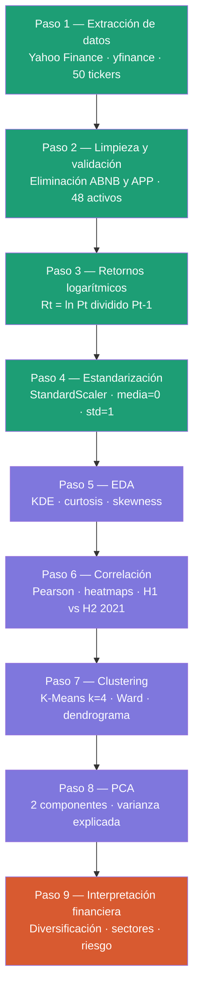

```mermaid
flowchart TD
    A[Paso 1 — Extracción de datos\nYahoo Finance · yfinance · 50 tickers] --> B
    B[Paso 2 — Limpieza y validación\nEliminación ABNB y APP · 48 activos] --> C
    C[Paso 3 — Retornos logarítmicos\nRt = ln Pt dividido Pt-1] --> D
    D[Paso 4 — Estandarización\nStandardScaler · media=0 · std=1] --> E
    E[Paso 5 — EDA\nKDE · curtosis · skewness] --> F
    F[Paso 6 — Correlación\nPearson · heatmaps · H1 vs H2 2021] --> G
    G[Paso 7 — Clustering\nK-Means k=4 · Ward · dendrograma] --> H
    H[Paso 8 — PCA\n2 componentes · varianza explicada] --> I
    I[Paso 9 — Interpretación financiera\nDiversificación · sectores · riesgo]

    style A fill:#1D9E75,color:#fff
    style B fill:#1D9E75,color:#fff
    style C fill:#1D9E75,color:#fff
    style D fill:#1D9E75,color:#fff
    style E fill:#7F77DD,color:#fff
    style F fill:#7F77DD,color:#fff
    style G fill:#7F77DD,color:#fff
    style H fill:#7F77DD,color:#fff
    style I fill:#D85A30,color:#fff
```